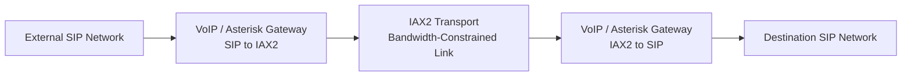

# VoIP Bandwidth Optimisation

## SIP-to-IAX2 Transport Architecture for Bandwidth-Constrained Networks

**Author:** Mohammad Sorower Jahan  
**Engineering Area:** VoIP, Telecommunications Infrastructure and Network Optimisation

---

## Project Overview

This repository documents an engineering project I carried out while investigating ways to reduce bandwidth consumption across constrained VoIP network links.

The main issue was not the ability to establish a call. SIP calls were already working. The problem was the amount of bandwidth required when a significant number of calls had to cross a limited-capacity network connection.

During testing, I compared the bandwidth behaviour of the existing SIP transport path with an alternative architecture using IAX2 between the two intermediate VoIP systems.

The resulting design kept SIP at the external edges of the network while using IAX2 across the bandwidth-constrained section.

The basic idea was:

```text
SIP Network
     |
     v
VoIP Gateway / Asterisk
     |
     | SIP converted to IAX2
     v
IAX2 Transport
     |
     | Bandwidth-constrained network
     v
IAX2 Transport
     |
     | Converted back to SIP
     v
Local SIP Gateway
     |
     v
Destination Network
```

The purpose of the work was not to replace SIP everywhere.

SIP remained appropriate for interconnection with external gateways and telecommunications systems. IAX2 was introduced only on the part of the network where reducing transport overhead had the greatest practical benefit.

---

## The Engineering Problem

The network had limited available bandwidth, while the number of simultaneous VoIP sessions could vary significantly.

Under the existing design, each SIP/RTP call generated its own signalling and media transport overhead.

When multiple calls were active, that overhead became important because the constrained link had to carry the aggregate traffic for all sessions.

The engineering question was:

**Could the transport architecture be changed without changing the external SIP interfaces, while reducing the bandwidth required across the constrained part of the network?**

I investigated this by separating the external SIP environment from the transport mechanism used internally.

---

## Architecture

The implemented design used SIP on both external sides and IAX2 between the intermediate VoIP systems.



This created two distinct parts of the call path.

### External interoperability

SIP remained the protocol used to communicate with the surrounding telecommunications infrastructure.

### Internal transport optimisation

IAX2 was used across the constrained network segment where reducing transport overhead was useful.

---

## Call Flow

A typical call followed this path:

```text
Incoming SIP Call
      |
      v
SIP Gateway
      |
      v
Asterisk / VoIP Interworking
      |
      | IAX2
      v
Constrained Network
      |
      | IAX2
      v
Remote Asterisk / VoIP Interworking
      |
      v
SIP Gateway
      |
      v
Destination
```

The two intermediate systems handled the protocol transition.

From the surrounding SIP infrastructure, the system continued to operate as a SIP-based telecommunications environment.

The IAX2 transport section was therefore largely transparent to the external systems.

---

## Why IAX2 Was Evaluated

The reason for testing IAX2 was its ability to carry VoIP signalling and media with lower protocol overhead in some multi-call transport scenarios.

The project was particularly interested in the effect of IAX2 trunking when several simultaneous calls shared the same network path.

Rather than changing the customer-facing or carrier-facing SIP infrastructure, the optimisation was applied only between the intermediate VoIP nodes.

This allowed the existing SIP environment to remain unchanged while testing a more bandwidth-efficient transport method internally.

---

## Observed Bandwidth Behaviour

During the original engineering tests, the SIP transport path used for the bandwidth-constrained environment was observed at approximately:

**29–32 kbps per call**

for the tested configuration.

The corresponding IAX2 transport arrangement was observed at approximately:

**9.6–10 kbps per call**

under the test conditions used for the project.

These measurements represented the behaviour of the particular implementation and test environment.

They should not be interpreted as universal bandwidth values for SIP or IAX2.

Actual bandwidth consumption depends on several factors, including:

- codec
- packetisation interval
- protocol overhead
- number of simultaneous calls
- IAX2 trunking configuration
- Ethernet and IP overhead
- signalling activity
- network conditions
- measurement method

The engineering result was therefore not simply that one protocol was always better than another.

The useful result was that, in this specific constrained-network implementation, moving the intermediate transport to IAX2 substantially reduced the measured bandwidth requirement.

---

## Bandwidth Reduction

Using representative observed values:

```text
SIP transport:
approximately 29–32 kbps

IAX2 transport:
approximately 9.6–10 kbps
```

the optimised transport path required roughly one-third of the bandwidth observed on the original SIP transport path.

For the project, I describe this as approximately a **three-times improvement in bandwidth efficiency**.

This is based on the measured project values rather than a claim that IAX2 universally provides a three-times improvement over SIP.

---

## Example Capacity Comparison

The bandwidth difference becomes more important as the number of simultaneous calls increases.

Using representative project values:

```text
100 simultaneous calls

SIP path at approximately 30 kbps:
100 x 30 kbps = approximately 3,000 kbps

IAX2 path at approximately 10 kbps:
100 x 10 kbps = approximately 1,000 kbps
```

This simplified example illustrates why transport overhead matters on bandwidth-constrained telecommunications links.

The actual capacity of a production system also depends on processor resources, memory, codec processing, network quality, concurrent signalling activity and other infrastructure limits.

---

## Engineering Approach

The project involved more than changing a protocol setting.

The work included:

- analysing the existing SIP traffic
- measuring bandwidth utilisation
- comparing transport behaviour
- designing an intermediate SIP-to-IAX2 architecture
- configuring the VoIP systems on both sides of the constrained network
- maintaining SIP interoperability at the external interfaces
- testing call establishment
- testing bidirectional voice
- investigating codec and media behaviour
- monitoring bandwidth consumption
- refining routing and interworking configuration
- troubleshooting signalling and media-path issues

The objective was to improve network efficiency without requiring the surrounding telecommunications infrastructure to be redesigned.

---

## Technical Areas

The project involved practical work with:

| Area | Application |
|---|---|
| SIP | External VoIP signalling and interoperability |
| RTP | SIP media transport |
| IAX2 | Intermediate VoIP transport |
| Asterisk | Protocol and call interworking |
| G.729 | Low-bandwidth voice codec used in the constrained environment |
| Linux | VoIP server platform |
| TCP/IP | Network transport |
| Routing | Communication between VoIP nodes |
| Traffic measurement | Bandwidth comparison and optimisation |
| VoIP troubleshooting | Signalling, codec and media-path analysis |

---

## Design Principle

One of the main lessons from the project was that optimisation did not require changing every component.

The architecture kept established SIP interfaces where they were already required and changed only the network segment where bandwidth consumption was the main constraint.

Conceptually:

```text
Keep SIP where interoperability is required.

Use the optimised transport where bandwidth is constrained.

Convert between the two at controlled network boundaries.
```

This approach reduced the impact of the change on the surrounding telecommunications infrastructure.

---

## SIP and IAX2 Roles

SIP and IAX2 served different purposes within the architecture.

### SIP

SIP was retained at the external interfaces because it provided compatibility with the existing telecommunications infrastructure.

The surrounding gateways and systems could continue operating without needing to understand the internal IAX2 transport arrangement.

### IAX2

IAX2 was introduced between the intermediate VoIP systems.

Its role was to provide the transport mechanism across the bandwidth-constrained section of the network.

The protocol transition therefore occurred at controlled points rather than throughout the whole telecommunications environment.

---

## Media Handling

The architecture required voice traffic to pass through the intermediate VoIP systems.

A call entering through SIP was processed by the first intermediate system before being transported through the IAX2 section.

At the other side of the constrained link, the remote system converted the call back into the required SIP environment.

This allowed the network between the two systems to use the transport arrangement selected for bandwidth optimisation while maintaining SIP compatibility at both ends.

---

## Codec Considerations

Codec choice was an important part of the overall bandwidth requirement.

The project included work involving G.729 because it was suitable for bandwidth-constrained VoIP environments.

However, transport protocol and codec should be considered separately.

The codec determines the encoded voice payload, while the network protocols add transport and signalling overhead.

The bandwidth measurements documented here relate to the complete tested implementation rather than to codec payload size alone.

This distinction is important when comparing different VoIP architectures.

---

## IAX2 Trunking

One of the areas investigated during the project was IAX2 trunking.

When several calls share the same path between two IAX2 systems, trunking can reduce some of the per-call transport overhead.

The practical benefit depends on the configuration and traffic pattern.

The project used this capability as part of the effort to reduce bandwidth consumption across the constrained network segment.

The results described in this repository relate to the specific engineering environment in which the tests were conducted.

---

## Operational Considerations

Bandwidth reduction was not the only consideration when designing the architecture.

The system also needed to maintain:

- reliable call establishment
- bidirectional audio
- correct number routing
- codec compatibility
- stable signalling
- acceptable voice quality
- fault isolation
- manageable troubleshooting

An optimisation that reduced bandwidth but caused unreliable calling would not have been useful.

The engineering work therefore considered both network efficiency and telecommunications reliability.

---

## Troubleshooting Approach

Testing involved examining different parts of the call path separately.

Where a call failed or voice quality was affected, the investigation considered:

- SIP signalling
- IAX2 signalling
- codec negotiation
- network reachability
- packet loss
- latency
- jitter
- routing
- firewall behaviour
- media flow
- bandwidth utilisation

This helped separate signalling problems from media or network problems.

---

## Measurement Methodology

Bandwidth utilisation was compared while calls were active across the relevant network path.

The purpose of the measurement was to understand the practical effect of changing the intermediate transport architecture.

The measurements represented the traffic observed in the project environment rather than a laboratory specification for either protocol.

Representative observed values were:

| Transport arrangement | Observed bandwidth |
|---|---:|
| Existing SIP transport path | approximately 29–32 kbps per call |
| IAX2 transport arrangement | approximately 9.6–10 kbps per call |

The comparison showed a substantial reduction in bandwidth consumption across the constrained section.

---

## Measurement Limitations

The bandwidth figures in this repository are project-specific observations.

They should be interpreted in the context of the original test environment.

The measurements may have been influenced by:

- codec choice
- packet size
- packetisation interval
- IAX2 trunking behaviour
- Ethernet overhead
- IP and transport headers
- call volume
- test methodology
- traffic capture point
- server configuration
- network conditions

For that reason, the values are presented as engineering observations rather than general specifications for SIP or IAX2.

---

## Engineering Result

The practical outcome of the project was an architecture that maintained SIP interoperability while reducing the amount of bandwidth required across the constrained transport section.

In the tested environment, the IAX2-based transport arrangement consumed approximately one-third of the bandwidth observed on the original SIP path.

This provided approximately a three-times improvement in bandwidth efficiency for the measured implementation.

The result demonstrated that transport architecture can be changed selectively without requiring every surrounding telecommunications component to be replaced.

---

## What This Project Does Not Claim

This project does not claim that:

- SIP is unsuitable for VoIP
- IAX2 is always more efficient than SIP
- every SIP call consumes 29–32 kbps
- every IAX2 call consumes 9.6–10 kbps
- every telecommunications network will achieve the same reduction
- transport protocol alone determines network capacity

The measurements and conclusions relate to the engineering environment and configuration used for this project.

---

## Engineering Scope

This repository documents the engineering architecture and technical reasoning behind the implementation.

It is not intended to suggest that SIP itself is inefficient or that IAX2 is preferable in every VoIP network.

The appropriate architecture depends on the operating environment.

For this project, the main constraint was bandwidth availability, and the IAX2 transport design produced a useful reduction under the conditions tested.

---

## Documentation

Additional technical documentation will be maintained in the `docs` directory.

Planned documentation includes:

- architecture and call flow
- bandwidth measurement methodology
- SIP and IAX2 interworking
- technical results and analysis
- project evidence
- verified technical evidence where original systems or records remain available

The planned repository structure is:

```text
voip-bandwidth-optimization/
│
├── README.md
│
└── docs/
    ├── architecture.md
    ├── bandwidth-testing.md
    ├── sip-iax2-interworking.md
    ├── results-analysis.md
    ├── project-evidence.md
    └── verified-technical-evidence.md
```

Files will be added as the underlying technical information and available evidence are reviewed.

---

## Evidence Approach

This repository is being prepared retrospectively from the original engineering work.

Where historical records or retained infrastructure are available, they will be identified separately from reconstructed diagrams and explanatory documentation.

Measurements will be presented as project-specific observations rather than general protocol specifications.

No historical screenshots, measurements or configuration files will be represented as original evidence unless their source can be established.

Where evidence is collected from a retained system at a later date, the actual inspection date will be stated clearly.

---

## Evidence Boundaries

Architecture diagrams created for this repository are explanatory reconstructions of the engineering design.

They should not be interpreted as diagrams originally produced during the historical project unless explicitly identified as such.

Likewise, any current screenshots taken from retained infrastructure will be labelled with their actual capture date.

Historical project dates, customer relationships and individual engineering contribution should be supported separately by appropriate documentary evidence where required.

---

## Repository Purpose

The purpose of this repository is to provide a structured technical record of the engineering work.

It is intended to explain:

- the original network problem
- the reasoning behind the SIP-to-IAX2 design
- the architecture used
- the bandwidth observations
- the engineering decisions taken
- the limitations of the measurements
- the evidence available to support the implementation

The repository is not intended to act as a universal benchmark for SIP or IAX2 performance.

---

## Author

**Mohammad Sorower Jahan**

Digital Technology & Telecommunications Infrastructure Engineer

Technical areas include:

VoIP | SIP | IAX2 | RTP | Asterisk | Linux | Network Infrastructure | Telecommunications Engineering

**GitHub:** [Core-daemon](https://github.com/Core-daemon)

**Website:** [www.msjahan.com](https://www.msjahan.com)

---

*This repository documents a practical telecommunications engineering and bandwidth-optimisation project. Measurement results relate to the implementation and test conditions described in this repository.*
