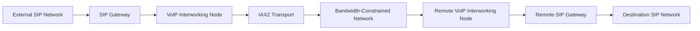

# Technical Architecture

## VoIP Bandwidth Optimisation Using SIP and IAX2

**Author:** Mohammad Sorower Jahan  
**Engineering Area:** VoIP, SIP, IAX2, Telecommunications Infrastructure and Network Optimisation

---

## 1. Architecture Purpose

This document describes the technical architecture used for the VoIP bandwidth optimisation project.

The main engineering objective was to reduce the amount of bandwidth required across a constrained network segment without replacing the surrounding SIP-based telecommunications infrastructure.

SIP remained in use at the external interfaces.

The transport between the intermediate VoIP systems was changed to IAX2.

The architecture therefore separated:

- external SIP interoperability
- internal bandwidth-optimised transport

---

## 2. High-Level Architecture

The logical call path was:

```text
External SIP Network
        |
        v
SIP Gateway / VoIP Node
        |
        | SIP processing
        v
Asterisk / Interworking Node
        |
        | IAX2
        v
Bandwidth-Constrained Network
        |
        | IAX2
        v
Remote Asterisk / Interworking Node
        |
        | SIP processing
        v
Remote SIP Gateway
        |
        v
Destination SIP Network
```

The external systems continued communicating through SIP.

IAX2 was used only across the network section where bandwidth efficiency was particularly important.

---

## 3. Logical Network Design

The design can be represented as:



The intermediate VoIP systems provided the protocol boundary between SIP and IAX2.

---

## 4. Protocol Separation

The architecture deliberately assigned different protocols to different parts of the network.

### SIP

SIP was retained where interoperability with existing telecommunications systems was required.

Typical functions included:

- call establishment
- call routing
- connection to SIP gateways
- connection to external telecommunications systems
- compatibility with existing VoIP infrastructure

### RTP

Where SIP endpoints were involved, voice media was transported using RTP according to the normal SIP/SDP negotiation process.

### IAX2

IAX2 was used between the intermediate VoIP systems across the constrained network segment.

Its purpose in this design was to provide a more bandwidth-efficient transport arrangement under the conditions tested in the project.

---

## 5. Protocol Interworking

The first intermediate VoIP system received a call from the SIP environment.

The system then established the corresponding call across the IAX2 transport section.

At the remote side, the second VoIP system converted the call back into the SIP environment required by the destination network.

The logical process was:

```text
SIP
 |
 v
SIP processing
 |
 v
IAX2
 |
 v
Constrained network
 |
 v
IAX2
 |
 v
SIP processing
 |
 v
SIP
```

This allowed the optimisation to remain internal to the network.

External telecommunications systems did not need to be redesigned to support IAX2.

---

## 6. Call Processing

A normal outbound call could be described as:

```text
1. SIP call arrives at the first gateway.

2. The intermediate VoIP system evaluates the destination.

3. A corresponding IAX2 call is established towards the remote system.

4. Voice traffic crosses the constrained network through the IAX2 path.

5. The remote VoIP system receives the IAX2 call.

6. The call is converted back into the required SIP environment.

7. The destination gateway completes the call.
```

The reverse direction followed the corresponding opposite path.

This provided bidirectional telecommunications connectivity.

---

## 7. Why the Optimisation Was Applied Internally

Replacing SIP throughout the complete telecommunications environment would have created unnecessary integration work.

Existing gateways and connected systems already supported SIP.

The main engineering problem existed only on the bandwidth-constrained network section.

The design therefore changed the transport mechanism only where the bandwidth limitation existed.

This reduced the scope of the change and preserved compatibility with the existing SIP infrastructure.

---

## 8. Bandwidth-Constrained Segment

The critical part of the architecture was the network connection between the two intermediate VoIP systems.

This segment had limited available bandwidth.

When multiple calls crossed this link simultaneously, total bandwidth utilisation became an important operational constraint.

The purpose of the IAX2 transport arrangement was to reduce the amount of bandwidth consumed across this section.

The optimisation did not change the physical capacity of the link.

It changed how VoIP traffic was transported across it.

---

## 9. Bandwidth Observations

During the engineering tests, representative bandwidth measurements were observed as follows:

| Transport arrangement | Observed bandwidth |
|---|---:|
| SIP transport path | approximately 29–32 kbps per call |
| IAX2 transport path | approximately 9.6–10 kbps per call |

These values relate to the tested implementation.

They are not presented as universal specifications for SIP or IAX2.

Bandwidth depends on factors such as:

- codec
- packetisation interval
- transport overhead
- trunking configuration
- number of simultaneous calls
- network headers
- measurement point
- traffic pattern

---

## 10. Multiple-Call Transport

The architecture was particularly useful when several calls crossed the same constrained network path.

Using representative project measurements:

```text
100 calls using approximately 30 kbps each

approximately 3,000 kbps
```

Compared with:

```text
100 calls using approximately 10 kbps each

approximately 1,000 kbps
```

This illustrates the engineering motivation for changing the internal transport architecture.

These calculations are simplified examples based on representative measured values.

They are not system-capacity guarantees.

---

## 11. Codec Considerations

Codec selection affects the amount of bandwidth required for a VoIP call.

The project included work involving G.729 for bandwidth-constrained voice transport.

However, codec bandwidth and total network bandwidth are not the same measurement.

A complete VoIP call also includes protocol overhead associated with transport, signalling and packet headers.

For this reason, the measurements documented in this project refer to observed network traffic rather than codec bitrate alone.

---

## 12. IAX2 Trunking

IAX2 trunking was relevant to the bandwidth optimisation strategy.

When multiple calls are transported between the same systems, trunking can reduce some of the overhead associated with carrying each call independently.

The project investigated this behaviour as part of the overall optimisation work.

The practical benefit depended on:

- number of simultaneous calls
- codec configuration
- packet timing
- network conditions
- system configuration

The project results therefore remain specific to the implementation that was tested.

---

## 13. Engineering Components

The architecture involved several technical layers.

| Layer | Function |
|---|---|
| SIP | External call signalling |
| SDP | Media negotiation in SIP sessions |
| RTP | Media transport within SIP call legs |
| IAX2 | Intermediate VoIP transport |
| Asterisk / VoIP systems | Protocol and call interworking |
| Linux | Server operating environment |
| IP networking | Connectivity between VoIP nodes |
| Routing | Delivery of traffic between network segments |
| Traffic monitoring | Measurement of bandwidth utilisation |

---

## 14. Failure and Troubleshooting Areas

Several different failure conditions could affect the architecture.

### SIP signalling problems

Examples include:

- call setup failure
- routing errors
- incompatible number formats
- authentication problems

### IAX2 problems

Examples include:

- unreachable remote node
- trunk configuration problems
- codec incompatibility

### Media problems

Examples include:

- one-way audio
- missing audio
- packet loss
- excessive latency
- jitter

### Network problems

Examples include:

- incorrect routing
- firewall filtering
- insufficient bandwidth
- unstable network links

The troubleshooting process separated these layers so that signalling and media problems could be analysed independently.

---

## 15. Architecture Advantages

The design provided several practical advantages for the project.

### Existing SIP infrastructure was retained

Connected telecommunications systems did not need to be redesigned.

### Optimisation was limited to the constrained network

Changes were applied only where they were required.

### External interoperability remained available

SIP continued to provide compatibility with surrounding systems.

### Bandwidth use was reduced in the tested environment

The IAX2 transport arrangement showed substantially lower measured bandwidth consumption under the project conditions.

---

## 16. Architecture Limitations

The design is not appropriate for every telecommunications network.

Considerations include:

- support for IAX2
- availability of suitable intermediate VoIP systems
- operational complexity
- codec compatibility
- security requirements
- troubleshooting requirements
- network topology

Modern deployments may also choose different technologies depending on their operating requirements.

This repository documents the engineering approach used for this particular project rather than prescribing a universal VoIP design.

---

## 17. Evidence Status

This document describes the engineering architecture based on the original project information.

Architecture diagrams in this repository are explanatory reconstructions.

They are not represented as original historical diagrams unless separately identified as such.

Bandwidth measurements are described as project observations.

Where original servers, configurations, logs or other technical records remain available, they will be reviewed separately and documented as verified technical evidence.

---

## 18. Architecture Summary

The essential engineering concept was:

```text
SIP interoperability
        |
        v
Controlled protocol boundary
        |
        v
IAX2 transport
        |
        v
Bandwidth-constrained network
        |
        v
IAX2 transport
        |
        v
Controlled protocol boundary
        |
        v
SIP interoperability
```

The design preserved the external SIP environment while changing the transport mechanism across the network segment where bandwidth consumption was the primary constraint.

---

## Author

**Mohammad Sorower Jahan**

Digital Technology & Telecommunications Infrastructure Engineer

Technical areas:

VoIP | SIP | IAX2 | RTP | Asterisk | Linux | Network Infrastructure | Telecommunications Engineering
